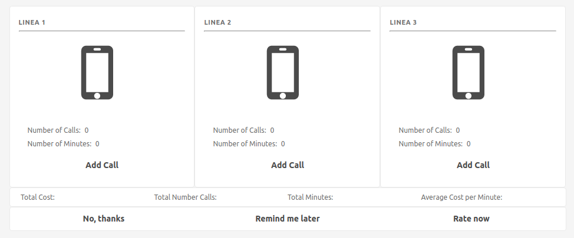

Telephone Lines
==================

Global Description
------------------

You want to create an application to control the telephone expenses of a company.
The company has three telephone lines through which you can
make local, long distance and cellular calls.

The company has telephone plans that establish the following rates:

Minute Local Call: $35 pesos
Minute Long Distance Call: $380 pesos
Cellular Call Minute: $999 pesos

The program must allow:

1. Add a call to one of the company's phone lines.
2. Display the information of each line. This information includes the number
    total number of calls made, total duration of calls in minutes
    and the total cost of the calls in pesos.
3. Display the consolidated information of all the telephone lines of
    the company. This information includes the total cost in pesos of the three
    lines, the total number of calls made, the total duration of
    calls in minutes and the calculation of the average cost per minute according
    total cost and total minutes.
4. Reset the information of the company's phone lines.

Objectives of the Exercise
-----------------------

In this exercise you will work on:

-Complete functional requirements.
-Construct arithmetic expressions.
-Complete methods.

Interface
========

